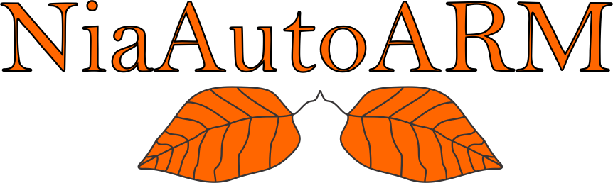

<p align="center">
  
</p>

<h1 align="center">
  NiaAutoARM
</h1>

<p align="center">
    
    
    <a href="https://pepy.tech/project/niaautoarm">
        
    </a>
    
    
</p>

<p align="center">
    
    
    
    <a href="http://isitmaintained.com/project/firefly-cpp/NiaAutoARM">
        
    </a>
    <a href="http://isitmaintained.com/project/firefly-cpp/NiaAutoARM">
        
    </a>
    
</p>

<p align="center">
  <a href="#-about">🔍 About</a> •
  <a href="#-how-it-works">💡 How it works?</a> •
  <a href="#-installation">📦 Installation</a> •
  <a href="#-usage">🚀 Usage</a> •
  <a href="#-further-read">📖 Further read</a> •
  <a href="#-references">📝 References</a> •
  <a href="#-license">🔑 License</a>
</p>

A novel AutoML method for automatically constructing the full association rule mining pipelines based on stochastic population-based metaheuristics.

* **Free software:** MIT license
* **Python**: 3.9, 3.10, 3.11, 3.12

## 🔍 About

The numerical association rule mining paradigm that includes concurrent dealing with numerical and categorical attributes is beneficial for discovering associations from datasets that consist of both features. The process is not considered as easy since it incorporates several components that form an entire pipeline, i.e., preprocessing, algorithm selection, hyperparameter optimization, and the definition of metrics that evaluate the quality of the association rule. NiaAutoARM software aims to automatize this process and reduce the need for the user's effort to discover association rules.

## 💡 How it works?

See the following [preprint](https://arxiv.org/pdf/2501.00138) for more information.

## 📦 Installation
### pip

To install `NiaAutoARM` with pip, use:

```sh
pip install niaautoarm
```

## 🚀 Usage
Explore the examples [directory](./examples) for more information on how to use the `NiaAutoARM` package.


## 📖 Further read
[1] [NiaARM.jl: Numerical Association Rule Mining in Julia](https://github.com/firefly-cpp/NiaARM.jl)

[2] [arm-preprocessing: Implementation of several preprocessing techniques for Association Rule Mining (ARM)](https://github.com/firefly-cpp/arm-preprocessing)

## 📝 References
[1] Ž. Stupan, Fister Jr., I. (2022). [NiaARM: A minimalistic framework for Numerical Association Rule Mining](https://www.theoj.org/joss-papers/joss.04448/10.21105.joss.04448.pdf). Journal of Open Source Software, 7(77), 4448.

[2] L. Pečnik, Fister, I., Fister, I. Jr. [NiaAML2: An Improved AutoML Using Nature-Inspired Algorithms](https://doi.org/10.1007/978-3-030-78811-7_23). In International Conference on Swarm Intelligence (pp. 243-252). Springer, Cham, 2021.

## 🔑 License
This package is distributed under the MIT License. This license can be found online at <http://www.opensource.org/licenses/MIT>.

## Disclaimer
This framework is provided as-is, and there are no guarantees that it fits your purposes or that it is bug-free. Use it at your own risk!
